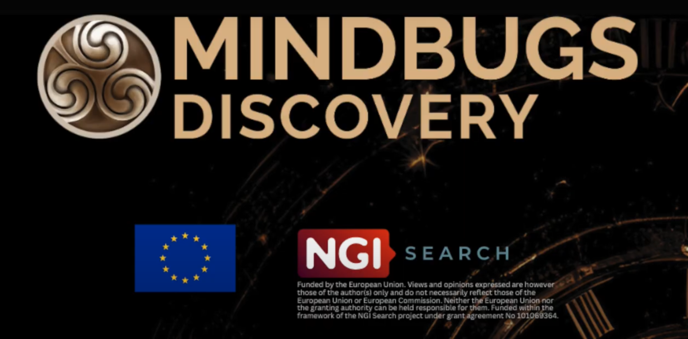

# OWL Web Visualizer

This project is a 3D web-based visualizer for ontologies (ttl files), built on top of the [3D Force-Directed Graph](https://github.com/vasturiano/3d-force-graph) library.

## Features

- **Fast Deployment:** Easily deploy the visualizer on your platform.
- **File Upload:** Use the "Load" button to upload your `.ttl` (Turtle) ontology files.
- **Interactive Exploration:** Navigate, search, and visualize the ontology with the implemented tools.
- **Node Expansion:** Click on nodes to expand them and reveal more connections within the ontology.
- **Node Deletion:** Remove nodes to declutter the visualization and focus on specific parts of the ontology (it does not delete the node from the db).
- **Search Functionality:** The system retrieves and displays text from the ontology that matches the search query, with case-insensitive matching.


## Deployment Instructions

To deploy the OWL Web Visualizer and its dependencies using Docker Compose, follow these steps:

### 1. Clone the Repository

First, clone the repository to your local machine:

```bash
git clone https://github.com/yourusername/yourrepository.git
cd yourrepository
```
### 2. Start the service using docker-compose
```
docker-compose up --build
```
### 3. Access the OWL Web Visualizer

The project starts at: http://localhost:5005

## How it works

This project uses a Neo4j database to manage and visualize ontology data. Upon uploading a `.ttl` file, the system automatically generates a Neo4j database, creating nodes and edges based on the ontology structure. The visualizer initially displays the first 10 nodes along with their respective connections.


### Component Overview

- **ExploreOWL:** Handles the upload function and the creation of the Neo4j database.
- **Neo4JConnector:** Manages interactions with the Neo4j database.
- **DataObject:** Facilitates data transfer between components.
- **API:** UI and connections.


## Project Background

This visualizer is a sub-component of the larger [MindBugs Discovery Project](https://discovery.mindbugs.ro/), 
where it is utilized to identify disinformation patterns. You can find the source code for the broader project [here](https://github.com/cheresioana/kg_repo).


## Credits

Funded by the European Union. Views and opinions expressed are however those of the author(s) only and do not necessarily reflect those of the European Union or European Commission. Neither the European Union nor the granting authority can be held responsible for them. Funded within the framework of the NGI Search project under grant agreement No 101069364.


